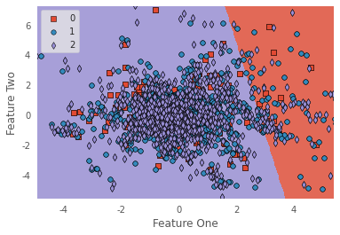

# Lending club dataset(2007~2018)에 대한 신용평가시스템

# 1. Dataset
## 1.1 Description
1. Lending Club에서 제공한 데이터(현재는 직접 다운로드 불가, [참고](https://www.kaggle.com/datasets/wordsforthewise/lending-club/discussion/317467))를 [가공](https://github.com/nateGeorge/preprocess_lending_club_data)한 데이터
   - `int_rate`, `revol_util` columns의 단위를 `%`에서 floats로 변환
   - 데이터에 약간의 문제가 있다는 얘기도 있다([참고](https://www.kaggle.com/datasets/wordsforthewise/lending-club/discussion/170691))
2. 기간: 2007년부터 2018년 
3. 2개의 csv파일로 구성
   - 대출 허용: `accepted_2007_to_2018Q4.csv`
     - FICO score 포함
   - 대출 거절: `rejected_2007_to_2018Q4.csv`
4. Features에 대한 설명: [https://resources.lendingclub.com/LCDataDictionary.xlsx](https://resources.lendingclub.com/LCDataDictionary.xlsx)


## 1.2 Download
1. Manual download \
[All Lending Club loan data](https://www.kaggle.com/datasets/wordsforthewise/lending-club)에서 다운로드

2. [`kaggle` API]((https://www.kaggle.com/docs/api)) 사용 \
[`download_dataset.sh`](download_dataset.sh)를 실행하여 `input` directory 안에 데이터를 다운로드할 수 있음
    ```
    input
    ├── LCDataDictionary.xlsx
    ├── accepted_2007_to_2018Q4.csv
    └── rejected_2007_to_2018Q4.csv
    ```


# 2. Baseline code
[🏦 Lending Club Loan 💰 Defaulters 🏃‍♂ Prediction](https://www.kaggle.com/code/faressayah/lending-club-loan-defaulters-prediction)


# 3. EDA
1. Missing values
    1. `emp_title`: 166810 (7.3%)
       - 알지 못하는 직업인 것 같다.
       - 빈도에 대한 cumulated sum threshold 이외의 값은 other로 변환하고 **embedding** 시키면 좋을 것 같다.
       - 아예 feature를 제거하는 것과 비교해볼 필요가 있음.
       - lower, period, -, &,  제거, strip 전처리 필요
    2. `emp_length`: 146873 (6.50%)
       - 87%: `emp_title` and `emp_length` isnull
       - 1%: `bemp_length` isnull only
       - 12%: `emp_title` isnull only
       - 다른 class들과 target과의 분포가 많이 다름 
       - `emp_length`가 null인 경우, 그렇지 않은 경우에 비해,
         - `loan_status=Charged Off`의 비율이 더 높고, `Current`의 비율이 높으며, `Fully Paid`의 비율이 낮다. 즉, 좀 더 힘든 상황이라는 것
         - `annual_income`의 평균이 거의 50%
         - `home_ownership=OWN`의 비율이 2배 높다.(연소득이 더 낮은데 자가의 비율이 높다. 금수저?)
         - `verification_status=Source Verified` 비율이 50% 밖에 안 됨
         - `dti`는 22% 더 높다
       - 대소문자 시작이 섞여있고, 글자가 짤려있는 것을 보면 문자인식으로 데이터를 수집한 것 같다.
       - 새로운 class(`other`)로 만드는 게 좋아보임
    3. `title`: 23323 (1.03%)
       - `purpose`와 중복된 데이터이므로 feature 제거
    4. `zip_code`: 1 (0.00%)
       - `addr_state`의 mutual info가 가장 크니 `zip_code`는 제거
    5. `dti`: 1711 (0.08%)
       - 진짜 정보를 얻을 수 없었던 거(thin filer) (`verification_status=Not Verificed` 가 86%)
       - `loan_status`의 비율
         - `dti` is not null: 1:4:5 (`Fully Paid` 많음)
         - `dti` is null: 0.5:7.5:2 (`Fully Paid` 적음)
       - 비율이 적다고 missing row를 없애버리면 얼마 없는 `loan_status=Current` 데이터를 그냥 갖다 버리는 거
       - isnull: 전부 `application_type=Joint App`
       - `dti_missing` feature를 새로 만드는 것이 좋을 것 같다. (1: `dti` is missing value, 0: `dti` is meaningful)
         - `dti`*`dti_missing` feature도 추가하여 의미를 추가해야 한다. 
       - 0 이하의 값은 0.1로 변환
         - -1 은 무슨 의미인지 잘 모르겠으나, 2개니까 0으로 봐도 큰 문제 없을 듯
         - 0은 반올림되어 0이 된 것 같다. (0.1도 있는 것을 보면)
       - log scale로 변환 (corr 증가)
    6. `annual_inc`: 0
       - 0인 경우가 사실 missing value. (0 부근의 값의 분포가 이외의 분포와 크게 다름, 146873 (6.50%))
       - 0인 경우,
         - `verification_status=Not Verified`가 거의 3배 가깝게 높음
         - `loan_status` 역시 `Current` 비율이 2배 높고, `Fully Paid` 비율이 50%도 안 됨
         - `emp_length`가 1년도 안 되는 경우가 4배 이상 높음 (알바?)
         - `grade`도 더 낮은 경향을 보인다(`A`, `B`의 비율이 5%씩 낮음)
         - `application_type=Joint App` 비율이 100%
       - 큰 특징의 차이가 있으므로, `dti`와 마찬가지로 flag feature를 만들 필요가 있음
    7. `revol_util`: 1762 (0.08%)
       - 결측치에 비해,
         - `loan_status=Current`의 비율이 25% 정도 더 높은 것을 보면 `dti` 처럼 thin filer 일지도?
         - `verification_status`는 오히려 더 상태가 좋음 (`Not Verified`의 30% 정도 더 낮음)
         - `revol_bal`의 평균이 더 높다는 것은, 평균적으로 빌릴 수 있는 돈이 더 많다? 아무튼, 연속적이지 않고 다른 형태의 분포를 가지고 있다.
       - `revol_util=0`인 경우, `revol_bal`의 분포가 봉우리가 2개인 mixture gaussian dist.로 보인다.
       - `revol_util` nan값은 0으로 imputing
       - 큰 특징의 차이가 있으므로, 결측치, 0값에 대한 flag feature를 2개 만들 필요가 있음
    8. `revol_bal`: 0
       - 0값이 엄청 많음.(10249)
       - Domain의 연속성이 있는 것 같기도하고 애매
       - 0값에 대한 flag feature 만들어 놓자
    9. `mort_acc`: 47281 (2.09%)
       - 결측치에서,
         - `grade`의 `A` 비율이 30% 정도 더 높음
         - `verification_status=Not Verified`의 비율이 33% 더 높고, `Source Verified`의 비율이 25% 더 낮음
         - `loan_status=Current`가 없음. 계좌가 없으니 그런 듯?
         - `initial_list_status=f`의 비율이 100%
         - `application_type=Individual`의 비율이 100%
       - 결측치가 target 뿐만 아니라 여러 feature에 결정적인 영향을 준다. (tree model에 적합)
       - 따라서, 결측치라는 표시를 해줄 feature를 추가하는 것이 필요.
    10. `pub_rec_bankruptcies`: 697 (0.03%)
        - 결측치에서,
          - `mort_acc`과 유사하게, 하나의 class로 선택되는 feature들이 많다.
          - `term=36 months` 전부
          - `verification_status=Not Verified` 거의 전부
          - `pub_rec=0` 거의 전부
          - `initial_list_status=f` 전부
          - `application_type=Individual` 전부
          - `mort_acc`이 전부 결측치
        - 따라서, 결측치라는 표시를 해줄 feature를 추가하는 것이 필요.


# 4. Proposed idea
## 1) [`proposed1`](proposed1.ipynb)
1. train, validation, test set 분리
   - 시간 상 전체 데이터의 1%만 사용 (1.3만 / .4만 / .4만)
2. `pycaret`을 이용하여 modeling 수행
   1. vanilla setting: 0.6532 (F1 score)
      - Recalls: [9%, 73%, 78%] \
      -> `0` class의 recall이 11% 밖에 안 됨 (타 class는 70% 이상) \
      -> **Data imbalance 문제 발생**
      - Feature importances(데이터의 1% 사용): `int_rate` >> `earliest_cr_line` > `annual_inc`, `revol_util`, `dti`, `sub_grade`, `revol_bal` > `installment`, `total_acc`, `loan_amnt` \
        데이터 개수에 따라서 feature importance도 달라지기 때문에 다양한 실험이 필요해보인다.
      - Feature importances(데이터의 10% 사용): `initial_list_status` >> `mort_acc_nan_x_mort_acc`, `application_type` >> `grade` > `term` > `sub_grade` > `int_rate` > `x1_Verified`, `x1_Not Verified` > `earliest_cr_line` \
      **많은 feature가 큰 의미를 가지지 않아보인다**
   2. `fix_imbalance=True`: 0.6375 (F1 score)
      - Over sampling을 하다보니 학습 시 시간이 좀 걸린다.
      - Recalls: [11%, 71%, 75%] \
      1번에 비해 F1 score가 0.02 낮지만, recall은 좀 더 낫다. \
      그러나 **근본적인 해결책은 되지 않는다.**
   3. `remove_outliers=True`: 0.6394 (F1 score)
      - Recalls: [8%, 70%, 77%] \
      1번보다 더 안 좋아졌다. 아마도 outlier에 중요한 정보가 있는 듯?
   4. `pca=True`: 0.5828 (F1 score)
      - Recalls: [5.5%, 63%, 72%] \
      1번보다 더 안 좋아졌다.
      - Decision boundary를 보니 model의 성능보다 더 구분력이 높은 feature가 필요한 것 같다.  
      
      - `pca_components=0.99` 인데도 92개 feature가 뽑힌 걸 보면 아마 엄청 많은 feature가 의미가 약한 것 같다.(embedding pad, etc)
   5. `feature_selection=True, feature_selection_threshold=0.5`: 0.6502 (F1 score)
      - Recalls: [8%, 72%, 78%] \
      1번에 비해 F1 score와 Recall이 좋진 않다.
      - Feature의 개수가 173개 밖에 안 되는 걸 고려하면 PCA보다 feature selection이 꽤 괜찮은 성능을 보이는 것 같다. \
      Categorical features에 대해서는 PCA보다 feature selection이 더 효과가 좋은걸까?
   6. Vanilla model, 10% data: 0.6715 (F1 score)
      - 전체 데이터의 10%를 사용
      - 큰 차이 없음
   7. `feature_selection=True, feature_selection_threshold=0.5`, 10% data: 0.6718 (F1 score)
      - 역시나, 175개 feature만 사용하는데도 큰 차이 없음
   8. `feature_selection=True, feature_selection_threshold=0.5, fix_imbalance=True`, 10% data: 0.6693 (F1 score)
      - 조금 F1 score가 떨어지긴하나 recall 역시 조금 오름
